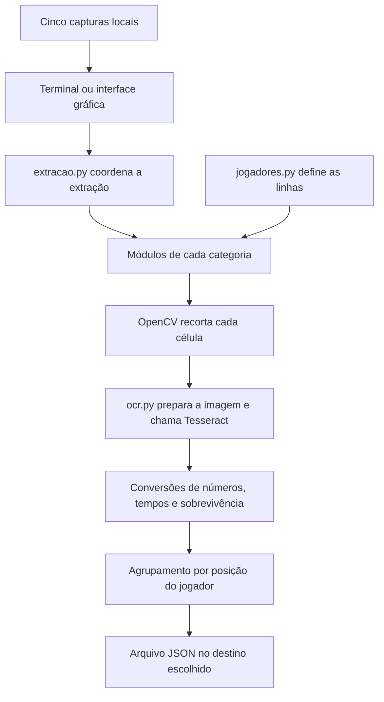

# AgeExtractor — negócio, propósito e funcionamento

> **Registro histórico:** este documento preserva a análise feita antes da reorganização em pastas. Os caminhos, comandos, inventário de arquivos e resultados de testes abaixo descrevem aquela etapa. Consulte o [README atual](../README.md) para a estrutura e a execução vigentes. O código agora está em `agextractor/`, a saída em `dados/saida/` e a referência JSON em `tests/fixtures/`. As imagens originais não estavam mais presentes no momento da reorganização; os testes de OCR real dependem de sua reposição.

## 1. Visão geral

O AgeExtractor é uma ferramenta local em Python que transforma imagens das telas de estatísticas de Age of Empires II em um arquivo JSON organizado por jogador. O projeto usa reconhecimento óptico de caracteres (OCR) para ler os números e textos das capturas, reunindo informações de placar, desempenho militar, economia, tecnologia e sociedade.

Seu propósito é tornar os dados visuais de uma partida reutilizáveis por outros programas, reduzindo a necessidade de transcrever manualmente cada estatística.

O estado atual é de um protótipo de extração: há um fluxo completo de imagens para JSON e um teste de regressão com os 180 campos das imagens de referência. Os recortes e o preparo para OCR foram corrigidos nesse layout. A leitura ainda depende da disposição e qualidade das capturas; o teste de uma partida não garante acurácia em outras imagens.

Esta documentação foi elaborada a partir do código, das seis imagens e do `resultado.json` presentes no projeto, em 7 de setembro de 2026, e atualizada após a correção da extração. As possibilidades de negócio descritas abaixo são interpretações do uso da ferramenta; não há um plano comercial formal nos arquivos analisados.

## 2. O negócio e o problema resolvido

As telas de estatísticas permitem consultar o desempenho dos participantes, mas seus dados estão apresentados visualmente. Para comparar partidas, alimentar uma planilha ou construir um histórico, alguém precisaria copiar esses valores ou desenvolver uma forma de extraí-los.

O AgeExtractor automatiza parte desse trabalho: recebe cinco capturas de uma partida e entrega um documento estruturado com os indicadores de cada participante.

### Público e valor potencial

| Público potencial | Utilidade dos dados extraídos |
| --- | --- |
| Jogadores | Revisar desempenho militar, coleta de recursos e tempos de avanço de idade. |
| Grupos e comunidades | Registrar partidas e comparar participantes. |
| Organizadores de eventos | Preparar estatísticas e relatórios de partidas. |
| Desenvolvedores e analistas | Usar o JSON como entrada para planilhas, bancos de dados e painéis. |

Esses usos dependem de validação dos dados e, em alguns casos, de funcionalidades adicionais. O projeto ainda não implementa histórico, rankings, gráficos, relatórios analíticos ou integrações.

A entrega atual é a extração e organização dos dados. Não há evidência de cobrança, assinatura, clientes cadastrados, modelo de receita ou operação de um serviço online.

## 3. Escopo implementado

O programa lê cinco arquivos locais, executa OCR em células predefinidas, aplica conversões simples e agrupa os resultados por posição do jogador na tabela. Ao final, grava `resultado.json` e imprime o mesmo conteúdo no terminal, com uma barra de progresso durante o processamento.

No terminal interativo, o progresso avança a cada célula concluída, com percentual decimal, tempo decorrido, estimativa de tempo restante e indicação da categoria, jogador e campo. Para seis jogadores são 174 células de OCR e uma etapa de gravação; o tributo gera dois campos a partir de uma célula. O percentual chega a 100% somente após salvar o JSON. A estimativa usa o tempo médio por célula e pode oscilar durante a execução.

A barra usa `stderr` e atualiza a mesma linha, adaptando-se à largura do terminal. Ao redirecionar a saída de progresso para um arquivo, são registradas apenas as mudanças de categoria, a gravação e a conclusão. O JSON impresso usa `stdout`, permitindo `python main.py > saida.json` sem misturar o progresso com os dados. Os extratores aceitam o callback opcional `ao_processar_celula(numero_jogador, nome_coluna)`; chamadas existentes com dois argumentos continuam funcionando.

A interface gráfica permite escolher de 2 a 8 jogadores, selecionar separadamente as cinco imagens e definir onde salvar o JSON. Ela mostra progresso por célula, tempo decorrido e estimativa restante, e permite cancelar a extração. O OCR roda em segundo plano para manter a janela responsiva. Não há captura automática da tela, leitura de replay, comunicação com o jogo, consumo de API, servidor web ou banco de dados.

Embora as imagens mostrem nomes, civilizações, equipes, símbolos de vitória e duração da partida, esses elementos não são extraídos. O campo `jogador` é somente um número sequencial, começando em 1. O indicador `sobreviveu` não identifica quem venceu.

## 4. Entradas e fluxo de processamento

### Imagens esperadas

| Arquivo | Conteúdo |
| --- | --- |
| `placar.jpeg` | Pontuações por categoria e pontuação total. |
| `militar.jpeg` | Unidades, construções e tamanho do exército. |
| `economia.jpeg` | Recursos coletados, comércio e tributos. |
| `tecnologia.jpeg` | Tempos de avanço de idade, exploração e pesquisas. |
| `sociedade.jpeg` | Maravilhas, castelos, relíquias, aldeões e sobrevivência. |

As cinco capturas utilizadas pelo fluxo atual medem 1600 × 899 pixels e apresentam seis jogadores. O arquivo adicional `estatisticas.jpeg` mede 1600 × 738 pixels, mostra uma tela econômica em português com quatro jogadores e não é usado pelo `main.py`.

As imagens precisam corresponder à mesma partida e manter os jogadores na mesma ordem. O código não verifica essa correspondência: ele une a primeira linha de cada imagem, depois a segunda, e assim por diante.



### Etapas internas

1. `main.py` usa seis jogadores e os nomes padrão de imagem; `interface.py` usa a quantidade, os arquivos e o destino escolhidos na janela. Ambos chamam `executar_extracao`, em `extracao.py`.
2. Cada extrator carrega sua imagem com `cv2.imread`. Se o carregamento falhar, lança uma exceção.
3. `gerar_linhas`, em `jogadores.py`, aceita quantidades entre 2 e 8 e seleciona faixas verticais predefinidas.
4. Cada módulo define as faixas horizontais das suas colunas. O cruzamento entre linha e coluna produz o recorte da célula.
5. As funções de `ocr.py` preparam o recorte e chamam o Tesseract.
6. O módulo converte o texto quando possível e retorna uma lista de dicionários.
7. `extracao.py` combina as cinco listas pelo índice e grava o JSON em UTF-8, com indentação de quatro espaços. O resultado é substituído somente depois de gravar o conteúdo completo em um arquivo temporário na pasta de destino. O terminal imprime também o JSON, enquanto a interface apresenta o caminho do arquivo salvo.

Os centros verticais são `259, 300, 342, 383, 425, 466, 507, 548`. Cada recorte vai de 12 pixels acima a 13 pixels abaixo do centro (limite final exclusivo), mantendo o texto e evitando a transição do fundo entre linhas. O suporte de 2 a 8 jogadores significa selecionar mais ou menos faixas dessa lista; não significa detectar automaticamente a tabela ou adaptar seu posicionamento. A validação com imagens cobre os seis primeiros jogadores.

## 5. Como o OCR funciona

| Função | Preparação e reconhecimento | Retorno |
| --- | --- | --- |
| `ler_numero` | Preparação compartilhada e caracteres permitidos `0123456789/`. | Texto sem espaços nas extremidades. |
| `ler_tempo` | Preparação compartilhada e caracteres permitidos `0123456789:`. | Busca um trecho no formato `H:MM:SS` ou `HH:MM:SS`; se não encontrar, devolve o texto reconhecido. |
| `ler_texto` | Preparação compartilhada, sem restrição de caracteres. | Texto sem espaços nas extremidades. |

As três funções usam `--psm 7`, configurando a leitura como uma única linha de texto. A preparação identifica o preenchimento amarelo das estrelas em HSV e remove o trecho inicial da célula até o contorno do ícone. Em seguida, converte para cinza, amplia 3 vezes com interpolação cúbica, aplica binarização de Otsu e adiciona uma borda branca. Se a leitura vier vazia, repete com ampliação de 4 vezes e margens ajustadas ao conteúdo, para auxiliar a leitura de dígitos isolados. Essa identificação de estrelas também depende do tamanho e das cores do layout de referência.

O caminho do executável está fixado em `ocr.py`:

```text
C:\Program Files\Tesseract-OCR\tesseract.exe
```

Não há registro de confiança do OCR nem revisão automática contra a imagem original durante o uso normal. A tentativa alternativa é acionada somente quando a primeira leitura está vazia.

## 6. Dados produzidos

O objeto principal contém `quantidade_jogadores` e a lista `jogadores`. Cada participante possui `jogador` e cinco grupos, totalizando 30 campos de estatísticas por participante.

| Grupo | Campos | Significado |
| --- | --- | --- |
| `placar` | `militar`, `economia`, `tecnologia`, `sociedade`, `pontuacao_total` | Pontuações exibidas pelo jogo, sem recálculo pelo extrator. |
| `militar` | `unidades_mortas`, `unidades_perdidas`, `construcoes_destruidas`, `construcoes_perdidas`, `unidades_convertidas`, `maior_exercito` | Indicadores militares. `unidades_mortas` corresponde à coluna “Units Killed”, isto é, unidades eliminadas pelo jogador. |
| `economia` | `comida`, `madeira`, `pedra`, `ouro`, `lucro_comercial`, `tributo_enviado`, `tributo_recebido` | Recursos coletados e movimentações econômicas. Os dois tributos são derivados de uma única célula enviado/recebido. |
| `tecnologia` | `idade_feudal`, `idade_castelos`, `idade_imperial`, `mapa_explorado`, `pesquisas`, `percentual_pesquisas` | Tempos de chegada às idades, percentual explorado, quantidade e percentual de pesquisas. |
| `sociedade` | `maravilhas`, `castelos`, `reliquias_capturadas`, `ouro_reliquias`, `maximo_aldeoes`, `sobreviveu` | Estatísticas de sociedade e sobrevivência até o fim. |

Os percentuais são lidos sem o símbolo `%`, sem conversão para frações. Os tempos permanecem como texto, sem conversão para segundos.

### Regras de conversão e suas consequências

| Situação | Comportamento atual |
| --- | --- |
| Texto composto apenas de dígitos | Conversão para inteiro nos campos numéricos. |
| Leitura vazia em economia ou em campos numéricos de sociedade | Conversão para zero. |
| Leitura vazia em placar, militar ou campos numéricos de tecnologia | Preservação da string vazia. |
| Texto numérico não reconhecido como inteiro | Em geral, permanece como string. |
| Tributo com `/` | Separação em enviado e recebido; cada lado inválido vira zero. |
| Tributo sem `/` | Ambos os valores viram zero. |
| Sobrevivência começando com `y` ou `n`, após conversão para minúsculas | Conversão para `true` ou `false`, respectivamente. Outros textos permanecem strings. |
| Tempo sem formato reconhecido | Preservação do texto retornado pelo OCR. |

Por isso, o JSON atual não garante tipos uniformes: um campo esperado como número pode conter texto. Além disso, zero pode representar tanto um valor real quanto uma falha de leitura. A conversão de sobrevivência pressupõe respostas em inglês, como `Yes` e `No`; não contempla `Sim`.

## 7. Organização dos arquivos

| Arquivo ou conjunto | Responsabilidade |
| --- | --- |
| `main.py` | Execução pelo terminal e apresentação do progresso e do JSON. |
| `interface.py` | Interface Tkinter para configurar a extração, escolher imagens e destino e acompanhar ou cancelar o processamento. |
| `AgeExtractor.pyw` | Atalho para abrir a interface sem console no Windows, se a extensão estiver associada ao Python. |
| `extracao.py` | Fluxo compartilhado, validação de entradas, eventos de progresso, consolidação e gravação do JSON. |
| `ocr.py` | Preparação das células e chamadas ao Tesseract. |
| `jogadores.py` | Validação da quantidade e seleção das faixas verticais. |
| `placar.py` | Extração das cinco pontuações. |
| `militar.py` | Extração dos seis indicadores militares. |
| `economia.py` | Extração econômica e separação dos tributos. |
| `tecnologia.py` | Extração de tempos e indicadores tecnológicos. |
| `sociedade.py` | Extração de sociedade e conversão de sobrevivência. |
| `analisar_placar.py` | Diagnóstico: amplia o placar duas vezes e imprime textos e suas coordenadas usando `image_to_data` com `--psm 6`. As coordenadas impressas pertencem à imagem ampliada. |
| `main_old.py` | Orquestração antiga, atualmente incompatível com as assinaturas de tecnologia e sociedade que importa. |
| `placar_old.py`, `militar_old.py`, `tecnologia_old.py`, `sociedade_old.py` | Versões anteriores com seis faixas de jogadores fixas. |
| `economia_old.py` | Versão anterior com quatro faixas verticais em outra posição e tributo mantido como texto. |
| Cinco imagens de categorias | Entradas do processamento principal. |
| `estatisticas.jpeg` | Imagem adicional de referência, fora do fluxo principal. |
| `resultado.json` | Saída das cinco imagens de referência, organizada em seis jogadores. |
| `tests/test_extracao.py` | Teste do fluxo completo, executado em pasta temporária. |
| `tests/test_fluxo.py` | Testes de parâmetros, cancelamento e preservação de saída em falhas. |
| `tests/test_interface.py` | Testes da interface, incluindo OCR real com caminhos personalizados e recuperação após erro ou cancelamento. Requer Tk e sessão gráfica. |
| `tests/resultado_esperado.json` | Transcrição manual dos 180 campos das imagens, usada como referência independente do OCR. |
| `__pycache__/` | Cache de bytecode gerado pelo Python. |

O `main_old.py` chama `extrair_tecnologia` e `extrair_sociedade` com apenas o caminho da imagem, mas importa suas versões atuais, que exigem também a quantidade de jogadores. A economia antiga retorna quatro participantes enquanto o placar antigo retorna seis. Esse conjunto deve ser tratado como histórico de desenvolvimento, não como alternativa funcional ao fluxo atual.

## 8. Execução local

O projeto depende de Python, OpenCV (`cv2`), `pytesseract` e do executável Tesseract OCR instalado separadamente. A interface usa Tkinter, normalmente incluído na instalação do Python para Windows; ele deve estar disponível com Tcl/Tk. `json` e `re` pertencem à biblioteca padrão do Python.

Não há `requirements.txt`, `pyproject.toml` ou declaração de versões mínimas. No ambiente inspecionado, foi possível importar OpenCV 5.0.0 e pytesseract 0.3.13; isso registra o ambiente observado, sem estabelecer uma matriz de compatibilidade.

Para preparar as bibliotecas Python em um ambiente escolhido:

```powershell
python -m pip install opencv-python pytesseract
```

O Tesseract deve existir no caminho configurado em `ocr.py`, ou esse caminho precisa ser ajustado. Instalar `pytesseract` não instala o executável do OCR.

### Pela interface gráfica

Execute:

```powershell
python interface.py
```

No Windows, também é possível abrir `AgeExtractor.pyw` com duplo clique, se a extensão `.pyw` estiver associada à instalação do Python com as dependências do projeto.

1. Informe a quantidade de jogadores, de 2 a 8.
2. Use **Selecionar…** em cada categoria: Placar, Militar, Economia, Tecnologia e Sociedade.
3. Escolha os prints correspondentes. Eles podem estar fora da pasta do projeto e ter nomes diferentes. Os seletores incluem JPEG, PNG, BMP, TIFF e WebP, sujeitos ao suporte do OpenCV instalado.
4. Em **Salvar como…**, escolha o arquivo JSON de saída, ou mantenha o destino exibido.
5. Clique em **Iniciar extração** e acompanhe a categoria, o jogador, o campo, o percentual e o tempo estimado.
6. Aguarde a mensagem **Concluído — JSON salvo com sucesso**. O arquivo pode então ser enviado à aplicação de análise.

Os campos de configuração ficam desabilitados durante a execução. **Cancelar** interrompe o fluxo após a leitura da célula atual e antes da gravação final. Fechar a janela durante o OCR solicita o mesmo cancelamento. Se o resultado já tiver sido gravado quando a solicitação chegar, a operação termina como concluída. Erros são apresentados na janela e permitem uma nova tentativa; o resultado anterior é preservado quando a extração falha ou é cancelada antes de salvar.

A seleção de outra quantidade e de novos arquivos não recalibra o OCR: as imagens ainda precisam seguir o layout de referência e manter a mesma ordem de jogadores. A acurácia foi conferida nas cinco imagens de seis jogadores do projeto; os testes de parâmetros 2 e 8 não representam validação visual de partidas dessas quantidades.

### Pelo terminal

O comando original continua disponível:

1. Coloque as cinco imagens na pasta do projeto, com os nomes esperados e layout compatível com os recortes.
2. Esse modo mantém a quantidade padrão de seis jogadores. Para escolher outra quantidade sem editar código, use a interface gráfica.
3. Execute o comando abaixo a partir da pasta que contém as imagens.
4. Confira o `resultado.json` comparando os valores com as imagens.

```powershell
python main.py
```

No terminal, os caminhos são relativos ao diretório de execução. Cada execução concluída substitui o `resultado.json` anterior após gravar o novo conteúdo em arquivo temporário. Na interface, são usados os caminhos selecionados. Não há processamento de várias partidas em lote nem identificação de partida no arquivo.

Para diagnóstico do posicionamento dos textos do placar:

```powershell
python analisar_placar.py
```

O fluxo fica na função `main()`, protegida por `if __name__ == "__main__"`. Importar o módulo não inicia o OCR nem grava a saída.

## 9. Qualidade dos dados e limitações observadas

A comparação inicial das imagens com o JSON revelou os erros abaixo. Eles motivaram a correção dos recortes e do preparo para OCR. A coluna final registra a saída anterior à correção, para documentar a regressão:

| Evidência | Valor correto na imagem | JSON anterior à correção |
| --- | --- | --- |
| Pontuação de sociedade do jogador 4 | `390` | `30` |
| Madeira coletada pelo jogador 1 | `53345` | `533` |
| Lucro comercial do jogador 1 | `18414` | `"/309855"` |
| Unidades eliminadas pelo jogador 3 | `498` | `"3 498"` |
| Idade dos Castelos do jogador 4 | `00:25:15` | `"90:25:15"` |
| Idade Feudal do jogador 5 | `00:11:11` | `"70011311"` |
| Tributo recebido pelo jogador 4 | `4252` | `0` |

Os recortes horizontais de economia foram corrigidos para cobrir suas seis colunas reais. Os limites das outras categorias e das linhas também foram revisados, e as estrelas de destaque passaram a ser removidas antes da leitura. O teste compara cada campo e seu tipo com valores transcritos manualmente, sem substituir leituras por valores esperados dentro do extrator.

Outras limitações relevantes:

- **Layout fixo:** não há ajuste de resolução, escala, deslocamento ou localização automática da tabela. Mesma resolução, por si só, não garante compatibilidade.
- **Identidade por posição:** mudanças na ordem dos jogadores entre telas produzem associações incorretas sem aviso.
- **Quantidade manual:** o valor configurado não é comparado à quantidade de participantes visíveis.
- **Validação insuficiente:** não há conferência da soma do placar, limites de percentuais, coerência dos tempos ou tipos finais.
- **Falhas sem recuperação:** imagens ausentes interrompem o fluxo. Recortes vazios agora geram um erro explícito, mas imagens com layout incompatível ainda podem produzir leituras incorretas.
- **Ausência de rastreabilidade:** o JSON não guarda confiança, recortes, nomes dos arquivos de origem, data da extração ou identificador da partida.
- **Cobertura limitada:** os testes de OCR real cobrem uma partida de seis jogadores, pelo terminal e pela interface. Há testes adicionais do fluxo, mas ainda não há configuração de dependências ou automação de testes em integração contínua.

## 10. Evoluções possíveis

A primeira prioridade foi implementada para as imagens de referência, e a interface atende parte da quarta prioridade. As demais continuam sendo propostas de evolução, sem compromisso de entrega.

| Prioridade | Evolução | Benefício |
| --- | --- | --- |
| 1 — implementada no layout atual | Recortes corrigidos, remoção de estrelas e teste com 180 campos conferidos nas imagens. | Corrigir os erros observados e detectar regressões nessa partida. |
| 2 | Diferenciar falha de OCR de zero e validar números, tempos e percentuais. | Evitar conclusões baseadas em dados inválidos. |
| 3 | Registrar confiança e disponibilizar recortes para revisão. | Facilitar a correção de células suspeitas. |
| 4 — parcialmente implementada | Interface para configurar caminhos, destino e quantidade de jogadores; configuração de layout ainda pendente. | Facilitar o uso com outras partidas. |
| 5 | Extrair nomes, equipes e metadados da partida. | Permitir identificação consistente e histórico. |
| 6 | Detectar tabela, linhas e colunas ou oferecer perfis de layout. | Ampliar a compatibilidade das imagens. |
| 7 | Adicionar persistência de partidas e exportações ou integrações. | Viabilizar comparações, relatórios e painéis. |

O passo essencial para ampliar o valor do projeto é tornar a extração verificável e confiável. Com essa base, o JSON pode servir de entrada para ferramentas de análise do desempenho dos jogadores.

## 11. Base e alcance da análise

Foram lidos os scripts atuais e antigos, inspecionadas visualmente as seis imagens e comparados exemplos com o JSON existente. Também foram verificados o parse sintático dos 15 arquivos Python, a leitura do JSON, as dimensões das imagens, a importação das bibliotecas e a existência do executável no caminho configurado.

Na etapa de correção, o fluxo completo passou a ser verificado por um teste de integração com OCR real. O teste executa `main.py` em diretório temporário, verifica o JSON gravado e compara os 180 campos e seus tipos com `tests/resultado_esperado.json`, preservando o resultado da pasta principal.

Resultado da verificação em 7 de setembro de 2026: os 180 campos coincidiram com a transcrição manual, usando Tesseract 5.5.3.20260724. O `resultado.json` principal também foi regenerado pelo extrator e conferido contra essa referência. Houve 36 alterações em relação à saída anterior, incluindo correções de valores e leituras de tempo que recuperaram o zero inicial.

```powershell
python -m unittest discover -s tests -v
```

O teste exige as bibliotecas e o executável Tesseract configurados. A transcrição esperada deve ser revisada manualmente se as imagens de referência forem substituídas. Não foi realizada uma avaliação estatística de acurácia nem validada a compatibilidade com outros layouts, idiomas, resoluções, níveis de compressão ou quantidades de jogadores.

Após a inclusão da interface, foram verificados os oito testes do conjunto: o fluxo original pelo terminal, quatro testes de parâmetros e proteção da saída, e três testes da interface. A extração real pela janela produziu o mesmo JSON de 180 campos usando arquivos em pasta temporária com nomes contendo espaços e acentos. A janela continuou processando eventos durante o OCR e exibiu atualizações intermediárias de progresso. Os testes de interface usam janelas ocultas e são ignorados quando não há uma sessão gráfica ou Tcl/Tk disponível.
